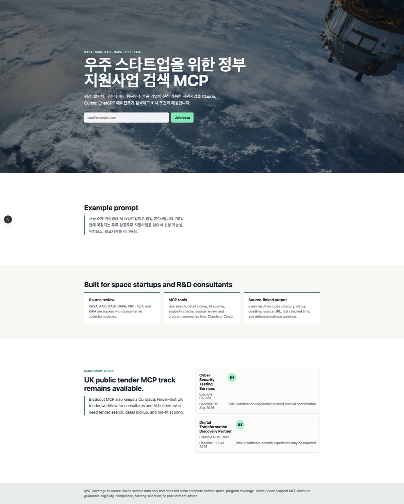

# Korea Space Support MCP

[](LICENSE)
[](package.json)
[](package.json)
[](https://modelcontextprotocol.io)
[](https://github.com/AgentBridge-Lab/korea-space-support-mcp/commits/main)
[](https://github.com/AgentBridge-Lab/korea-space-support-mcp/stargazers)

> **한국 우주·항공·국방우주·R&D 지원사업 공고**를 AI 에이전트가 곧바로 검색·매칭할 수 있도록 정리한 데이터셋과 Model Context Protocol(MCP) 서버, REST API, 검증 파이프라인입니다.

기업·스타트업·대학 연구실·연구팀·컨소시엄에게 **마감일이 명확한 실제 공고**만 추천하도록 설계되었습니다. Claude, Cursor, ChatGPT 등 도구 호출이 가능한 에이전트에서 바로 사용할 수 있습니다.



---

## 현재 데이터 스냅샷

| 항목 | 값 |
|---|---|
| 생성된 공고 | **51건** |
| 활성(마감일 ≥ 오늘) | 22건 |
| 출처 패밀리 | 12개 (KARI · KASA · KASI · DAPA · ADD · TIPA/SMTECH · KAIA · DJTP · JNTP · GNTP · ITP · Bizinfo) |
| Bizinfo 원기관 출처 URL 보유율 | 17 / 17 |
| 제외(마감일 판독 불가 등) | 0 |
| 자동 갱신 주기 | 매주 월 09:00 KST (launchd) |

수치는 매 `npm run ingest:space` 시점에 갱신됩니다.

---

## 무엇이 들어 있나

```
apps/
  api/      Fastify REST 서버   →  /space-programs/search, /space-programs/:id, /health
  mcp/      MCP stdio 서버      →  search_space_programs, get_space_ingest_report
  web/      Next.js 랜딩 데모   (서버 렌더 카드 미리보기)
packages/
  shared/   검색·스코어링·분류·소스 메타·타입 정의 (모든 surface 공용)
scripts/
  ingest-space-programs.mjs       # 크롤러 + 분류기 + 데이터 작성기
  verify-space-search-samples.mjs # 검색 UX 시나리오 회귀
  verify-space-api-mcp-smoke.mjs  # API + MCP 스모크
  run-space-refresh.mjs           # ingest + diff + history 기록
data/
  space-programs.generated.json   # 현재 데이터셋
  space-programs.excluded.json    # 제외 감사 로그
  space-ingest-report.json        # 출처별 카운트·시간
  space-refresh-diff.json
  space-refresh-history.jsonl
ops/launchd/
  com.bidscout.space-refresh.plist  # 주간 자동 갱신 에이전트
docs/
  space-mcp-handoff.md            # 프로젝트 인계서
  space-ingestion-runbook.md      # 운영 룬북
  korea-space-mcp-work-report.md  # 진행 리포트
```

---

## 빠른 시작

```bash
git clone https://github.com/AgentBridge-Lab/korea-space-support-mcp.git
cd korea-space-support-mcp
npm install

# (선택) 출처에서 새로 ingest 하려면 Python 의존성 1회 설치
python3 -m pip install --user curl_cffi beautifulsoup4 pyyaml olefile
# PDF 마감일 추출에는 pdftotext(빌드된 poppler 등)도 사용됩니다

# 사전 생성된 데이터 즉시 조회
cat data/space-programs.generated.json | jq '.[].title' | head

# REST API 실행
npm run dev:api    # http://localhost:4000

# MCP stdio 서버 실행 (Claude Desktop, Cursor 등에서 사용)
npm run dev:mcp

# 랜딩 데모 실행
npm run dev:web    # http://localhost:3001
```

---

## REST API 예시

```bash
# Health
curl http://localhost:4000/health

# 예비창업자/스타트업 대상 + 90일 이내 마감 우주 공고
curl "http://localhost:4000/space-programs/search?applicantType=startup_or_prefounder&includeAdjacent=true&deadlineWithinDays=90&limit=5" | jq

# 연구자/대학 연구실 대상 공고
curl "http://localhost:4000/space-programs/search?applicantType=researcher_or_lab&limit=10" | jq

# 방산/이중용도 우주 공고
curl "http://localhost:4000/space-programs/search?defenseOnly=true&limit=10" | jq

# id 기반 상세 조회
curl "http://localhost:4000/space-programs/space-bizinfo-discovered-PBLN_000000000122300" | jq
```

---

## MCP 서버로 사용하기

Claude Desktop 설정 파일에 추가 (`~/Library/Application Support/Claude/claude_desktop_config.json`):

```json
{
  "mcpServers": {
    "korea-space-support": {
      "command": "node",
      "args": ["/절대경로/korea-space-support-mcp/apps/mcp/dist/index.js"],
      "env": {}
    }
  }
}
```

`npm run build` 이후 에이전트가 다음 두 도구를 사용할 수 있습니다.

| 도구 | 용도 |
|---|---|
| `search_space_programs` | 신청자 유형·상태·마감 윈도우·방산/인접 포함 여부·출처 패밀리로 필터링 |
| `get_space_ingest_report` | 출처별 카운트, 제외 사유, 데이터 신선도 확인 |

---

## 샘플 레코드

```jsonc
{
  "id": "space-bizinfo-discovered-PBLN_000000000122300",
  "title": "[전남] 순천시 위성 개발 및 실증 사업 참여기업 모집 공고",
  "agency": "전라남도/전남테크노파크",
  "sourceUrl": "https://www.bizinfo.go.kr/sii/siia/selectSIIA200Detail.do?pblancId=PBLN_000000000122300",
  "originalAgencyUrl": "https://data.jntp.or.kr/jntp/content/business/announcement/view.jsp?idx=1063",
  "sourceFamily": "BIZINFO",
  "spaceCategory": "satellite",
  "applicationStartDate": "2026-05-21",
  "applicationEndDate": "2026-06-23",
  "status": "active",
  "deadlineSource": "html_body",
  "deadlineExtractionStatus": "found",
  "summary": "전남도 순천시 위성 개발 및 실증 사업 참여기업 모집…",
  "defenseOrDualUse": false,
  "relevanceScore": 84
}
```

모든 레코드는 아래 정보를 함께 보관합니다.

- **공식 `sourceUrl`** (집계기 안정 링크) 그리고 가능한 경우 **`originalAgencyUrl`** (원공고 발급기관 페이지)
- **`deadlineSource`** + **`deadlineEvidenceUrl`** — 마감일을 재검증할 수 있는 근거 위치
- **`dataReusePolicy`** — 보수적으로 설정. 본 프로젝트는 **메타데이터 + 짧은 요약**만 저장하며, 공고 본문 전체는 저장하지 않습니다.

---

## 수집 정책 (포함 / 제외)

✅ **포함**: 기업·스타트업·연구자·대학 연구실·연구팀·컨소시엄을 대상으로 한 **마감일 명시 공개 공고**. 분야는 우주·항공·국방우주·드론/UAM·천문·위성·발사체·부품소재.

❌ **제외** (이유와 함께 `space-programs.excluded.json`에 기록):

- 가이드, 포털, 큐레이션 인덱스
- 행사·전시·박람회·세미나·포럼·컨퍼런스·공모전·아이디어 대회
- 채용, 조달/입찰, RFP, 계약 결과, 선정 결과 공고
- 신청 마감일을 읽을 수 없는 공고

---

## 검증

```bash
npm run verify:space
# 실행 순서: 구조 검증 → 검색 UX 시나리오 → API+MCP 스모크 →
#           Node 테스트 → typecheck → build (shared + api + mcp + web)
```

현재 상태: **테스트 13/13 PASS**, 경고 0건, 실패 0건.

---

## 주기적 자동 갱신

macOS 용 launchd 에이전트가 `ops/launchd/com.bidscout.space-refresh.plist`에 포함되어 있습니다.

```bash
cp ops/launchd/com.bidscout.space-refresh.plist ~/Library/LaunchAgents/
launchctl bootstrap "gui/$(id -u)" ~/Library/LaunchAgents/com.bidscout.space-refresh.plist
launchctl kickstart -k "gui/$(id -u)/com.bidscout.space-refresh"   # 즉시 1회 실행
```

plist 의 `PATH`는 `/usr/bin/python3`(curl_cffi/olefile 보유)이 Homebrew Python 3.14 보다 먼저 잡히도록 설정되어 있습니다.

---

## 라이선스

[MIT](LICENSE) © 2026 AgentBridge-Lab

---

## 참고

- 본 저장소에는 이전에 만들었던 **BidScout MCP UK tender MVP**가 보조 트랙(`uk-tender-mcp-*` 문서)으로 함께 남아 있습니다. 현재 주력 트랙은 Korea Space 입니다.
- 작업에는 [Claude Code](https://claude.ai/code) 와 [Happy](https://happy.engineering) 의 도움을 받았습니다.
